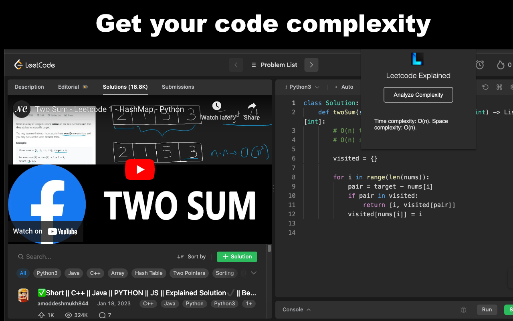

# Leetcode Explained

A chrome extension that adds video solutions directly into Leetcode problem pages.

[Available in the Chrome Web Store](https://chrome.google.com/webstore/detail/leetcode-explained/cofoinjfjcpgcjiinjhcpomcjoalijbe)

[Watch the demo](https://www.youtube.com/watch?v=E5nvCyVZxuc)

## Table of Contents

- [Installation](#installation)
- [Usage](#usage)
- [Structure](#structure)
- [Configuration](#configuration)
- [Browser Compatibility](#browser-compatibility)

## Installation

1. Download the Leetcode Explained repository.
2. Unzip the folder if needed.
3. Open Chrome and go to `chrome://extensions`.
4. Enable "Developer mode" in the top right corner.
5. Click "Load unpacked" and select the `src` folder within the unzipped Leetcode Explained folder.

## Usage

### Access video solutions
1. Navigate to a Leetcode problem page (e.g., `https://leetcode.com/problems/valid-parentheses`).
2. Click the 'Solutions' tab.
3. A video explanation of the solution will be injected into the page if available.

### Get your code's time & space complexity

1. Navigate to a Leetcode problem page (e.g., `https://leetcode.com/problems/valid-parentheses`).
2. Open the extension by clicking on the Leetcode Explained icon in the Chrome toolbar.
3. If not logged in, click the "Please login to ChatGPT" button to authenticate with ChatGPT.
4. Click the "Analyze Complexity" button to get the time and space complexity of the solution.

## Structure

The extension is organized into the following folders and files:

- `src/`: Contains the main source files for the extension.
  - `assets/`: Contains images and the json data of leetcode problems and their embedded urls
  - `background/`: Tells content script to add video if tab url matches a leetcode problem name
    - `chatgpt/`: Stores auth token when user logs into ChatGPT. ChatGPT is used to get the user's code complexity.
  - `content-script/`: Adds video onto the page. Gets user's code to send to ChatGPT.
  - `popup/`: Contains the 'Analyze Complexity' button
- `manifest.json`: Metadata such as version, permissions, files, etc.

## Configuration

The extension configuration is contained in the `manifest.json` file. You can update the extension's name, version, description, permissions, and other settings in this file.

## Browser Compatibility

Leetcode Explained works on most Chromium-based browsers. Other browsers, such as Mozilla Firefox, currently aren't supported.