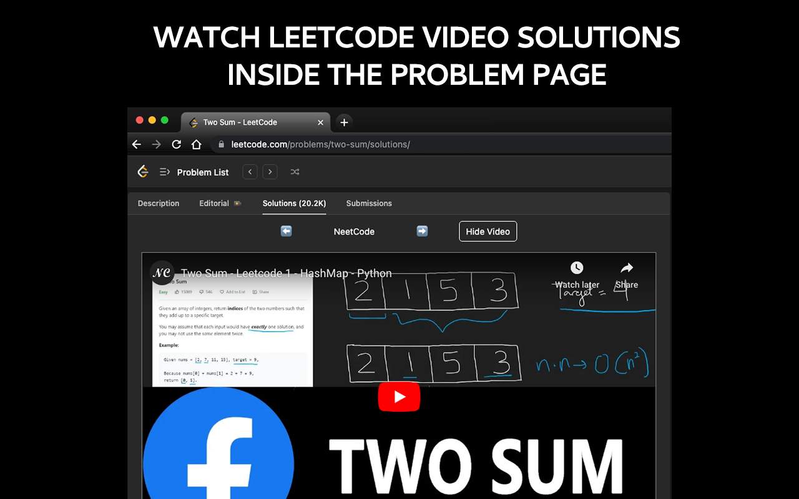
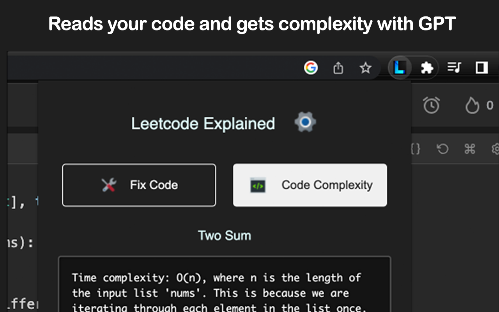
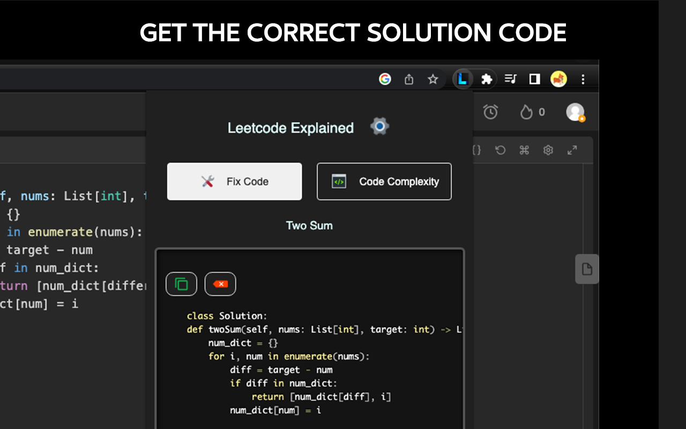

# Leetcode Explained 


 
[](https://opensource.org/licenses/MIT)

A free, open source browser extension that enhances Leetcode problems with code solutions, video explanations, and GPT code analysis.

[](https://chrome.google.com/webstore/detail/leetcode-explained/cofoinjfjcpgcjiinjhcpomcjoalijbe)
[](https://addons.mozilla.org/en-US/firefox/addon/leetcode-explained/)
[](https://chrome.google.com/webstore/detail/leetcode-explained/cofoinjfjcpgcjiinjhcpomcjoalijbe)
### Features

1️⃣ Solution videos: Adds the top 5 youtube solution videos into each [problem](https://leetcode.com/problems/two-sum/solutions)

2️⃣ Complexity Analysis
Reads your code and gets the time & space complexity using GPT

3️⃣ Code Generation
Reads your code, fixes bugs, and generates the optimal solution code for the given problem using GPT. For more accurate results, open the description tab so GPT can read the problem's description and constraints.

4️⃣ Elo ratings
Adds difficulty ratings into weekly/biweekly contest problems (~1500 added)

5️⃣ Hard Mode
Hide the Leetcode problem examples to simulate a real coding interview environment. Available through the extension's settings.

### ⚙️ Installation


1. ``` git clone https://github.com/zubyj/leetcode-explained.git ```
2. ``` cd leetcode-explained ```
3. ``` npm install && tsc```
4. Open Google Chrome and navigate to ```chrome://extensions``` in the search bar.
5. Enable "Developer mode" (top right corner).
6. Click on "Load unpacked" and navigate to the extension directory, then click "Select".
7. Pin the extension. You should now see the extension icon next to the address bar.

Now you can test the latest dev version and contribute new features! After you make changes, remember to run tsc to compile the TS files into javascript.
### 📚 Tutorial

For solution videos open a Leetcode problem's
[solutions tab](https://leetcode.com/problems/two-sum/solutions)

 If you pin the extension in the toolbar & login into ChatGPT in your browser, you can use the following 2 GPT buttons:

- Get your code complexity using ChatGPT
- Fix bugs in your code and return the optimal solution

Please ensure your Leetcode solution is open so the extension can read your code from the page.

### Contributing

We welcome contributions! Please see the [CONTRIBUTING.md](docs/CONTRIBUTING.md) for details on how to contribute to the project.

### Screenshots






### Code of Conduct

We aim to foster an inclusive and respectful environment. Please read the [CODE_OF_CONDUCT.md](docs/CODE_OF_CONDUCT.md) for more information.

### License

Leetcode Explained is [MIT licensed](docs/LICENSE).

### Support

If you encounter any issues or have any questions, please open an issue on this repository.

### Privacy

This extension doesn't collect any personal data. All the code analysis and generation happens on your local machine.

If you like the extension, please leave a review in the Reviews tab. For questions or bugs, feel free to open an issue on Github.

### References

Check out these cool datasets used in Leetcode Explained

[Problem elo ratings](https://github.com/zerotrac/leetcode_problem_rating) 