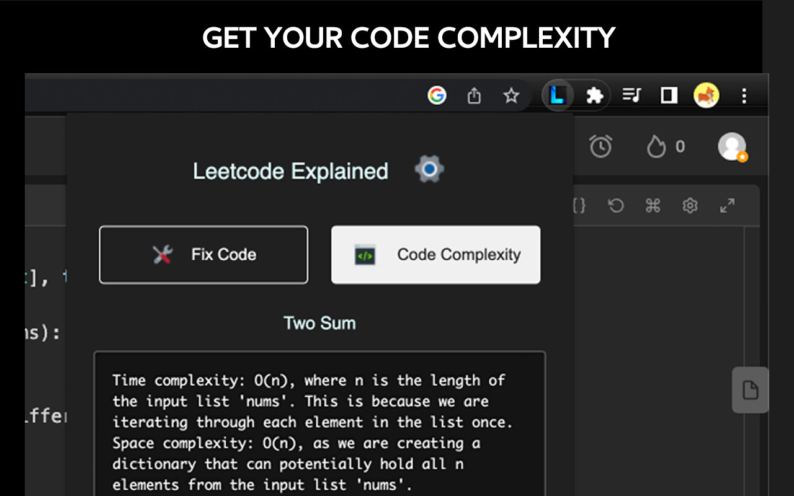

# Leetcode Explained

Leetcode Explained is a Chrome Extension that allows users to watch Leetcode video solutions directly inside the problem page. It also enhances your Leetcode experience by integrating AI-powered code analysis and solution generation functionality.

Available on the [Chrome Web Store](https://chrome.google.com/webstore/detail/leetcode-explained/cofoinjfjcpgcjiinjhcpomcjoalijbe).

## Features
1️⃣ Watch solution videos directly inside each Leetcode problem

2️⃣ Analyze your code complexity using ChatGPT

3️⃣ Fix errors in your code using ChatGPT

Additional details:
- Free and open source: [github.com/zubyj/leetcode-explained](https://github.com/zubyj/leetcode-explained)
- No API key required for using ChatGPT. Simply login to ChatGPT in your browser.
- 5 solution videos added per problem
- No data stored. All data is stored locally in your browser

## Installation

1. Install the extension directly from the [Chrome Web Store](https://chrome.google.com/webstore/detail/leetcode-explained/cofoinjfjcpgcjiinjhcpomcjoalijbe).

OR

2. Download the latest version of the extension from the [releases](./build) directory as a zip file.
   Unzip the downloaded file into a directory.
   Open Google Chrome and navigate to chrome://extensions.
   Enable "Developer mode" (toggle switch in the top right corner).
   Click on "Load unpacked" and navigate to the unzipped extension directory, then click "Select".
   Ensure that the extension is enabled. You should now see the extension icon next to the address bar.

## Usage
To view solution videos, open the "Solutions" tab of a Leetcode problem.
For example ➡️ [leetcode.com/problems/two-sum/solutions/](https://leetcode.com/problems/two-sum/solutions/)

To fix your code or analyze its complexity, you first need to be logged into ChatGPT in your browser and have this extension pinned. Then, simply open your Leetcode solution and click the extension to use the awesome GPT features!

## Contributing
Please see the [CONTRIBUTING.md](docs/CONTRIBUTING.md) for details on how to contribute to the project.

## Code of Conduct
We aim to foster an inclusive and respectful environment. Please read the [CODE_OF_CONDUCT.md](docs/CODE_OF_CONDUCT.md) for more information.

## License
Leetcode Explained is [MIT licensed](docs/LICENSE).

## Support
If you encounter any issues or have any questions, please open an issue on this repository.

## Privacy
This extension doesn't collect any personal data. All the code analysis and generation happens on your local machine.
