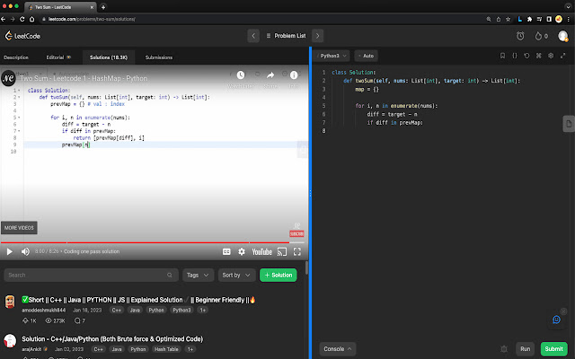
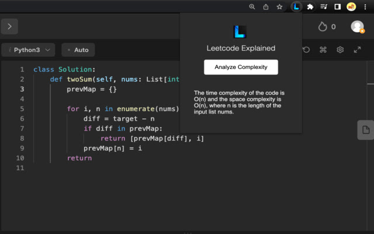

# Leetcode Explained

A Chrome extension that helps you learn and understand Leetcode solutions by providing video explanations and complexity for each solution.

<iframe width="1236" height="695" src="https://www.youtube.com/embed/E5nvCyVZxuc" title="Introducing Leetcode Explained" frameborder="0" allowfullscreen></iframe>

[Available in the Chrome Web Store](https://chrome.google.com/webstore/detail/leetcode-explained/cofoinjfjcpgcjiinjhcpomcjoalijbe)

### Adds Neetcode video solutions into Leetcode problems

### Gets your codes time & space complexity using ChatGPT

## Table of Contents

- [Installation](#installation)
- [Usage](#usage)
- [Structure](#structure)
- [Configuration](#configuration)
- [Browser Compatibility](#browser-compatibility)

## Installation

1. Download the Leetcode Explained repository.
2. Unzip the folder if needed.
3. Open Chrome and go to `chrome://extensions`.
4. Enable "Developer mode" in the top right corner.
5. Click "Load unpacked" and select the `src` folder within the unzipped Leetcode Explained folder.

## Usage

1. Navigate to a Leetcode problem page (e.g., `https://leetcode.com/problems/valid-parentheses`).
2. Open the extension by clicking on the Leetcode Explained icon in the Chrome toolbar.
3. If not logged in, click the "Please login to ChatGPT" button to authenticate with ChatGPT.
4. Click the "Analyze Complexity" button to get the time and space complexity of the solution.
5. A video explanation of the solution will be injected into the page if available.

## Structure

The extension is organized into the following folders and files:

- `assets/`: Contains images and other static files.
- `src/`: Contains the main source files for the extension.
  - `background/`: Contains background script and related files.
    - `chatgpt/`: Contains ChatGPT related files.
  - `content-script/`: Contains content scripts that interact with the Leetcode website.
  - `popup/`: Contains the popup UI for the extension.
- `manifest.json`: The extension manifest file.

## Configuration

The extension configuration is contained in the `manifest.json` file. You can update the extension's name, version, description, permissions, and other settings in this file.

## Browser Compatibility

Leetcode Explained has been tested on the Google Chrome browser. It may work on other Chromium-based browsers, but compatibility is not guaranteed.
