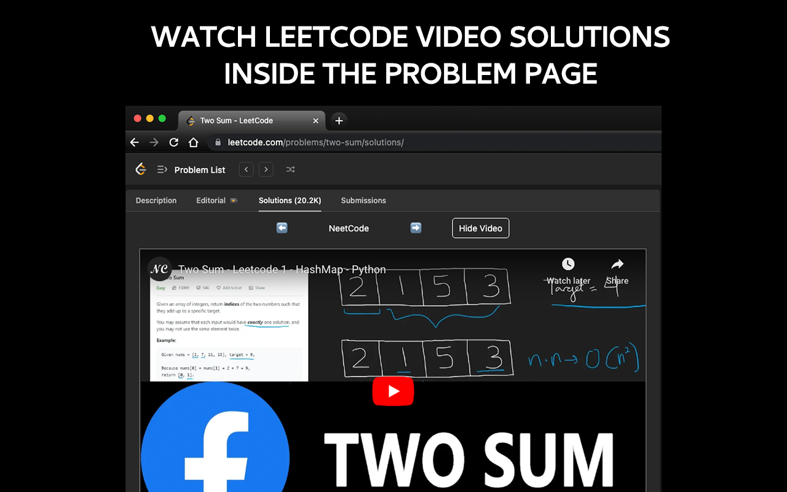
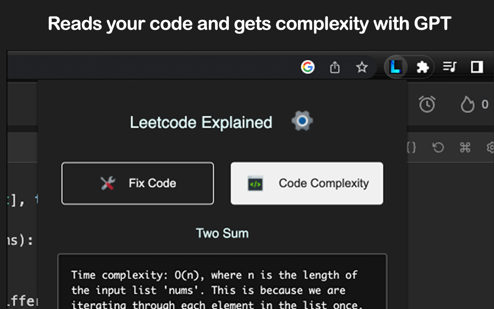
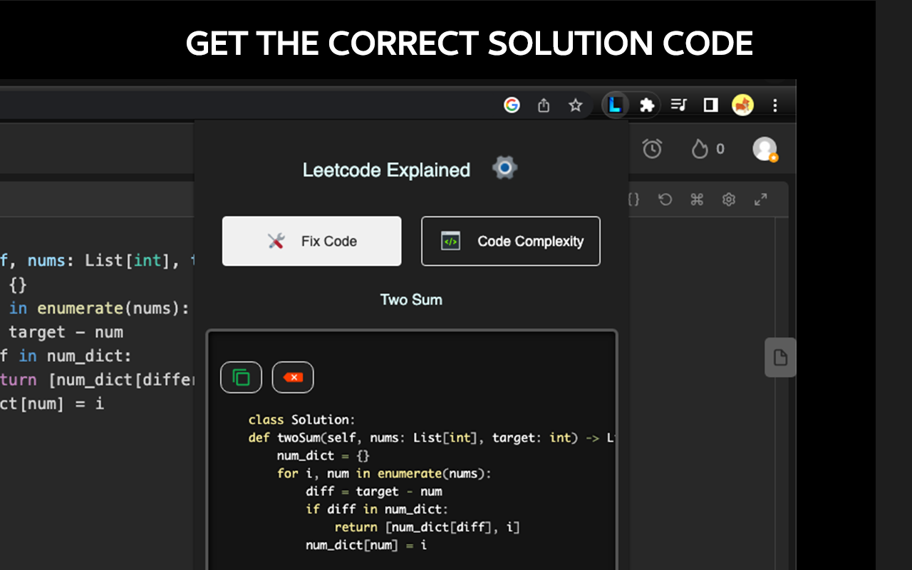

# Leetcode Explained


[](https://opensource.org/licenses/MIT)

**Enhance Leetcode with AI-generated solutions, video explanations, and smart features.**  
100% free and open source.

[](https://chrome.google.com/webstore/detail/leetcode-explained/cofoinjfjcpgcjiinjhcpomcjoalijbe)
[](https://addons.mozilla.org/en-US/firefox/addon/leetcode-explained/)

---

## 🚀 Key Features

- **Code Solutions**  
  Ready-to-use solutions in Python, Java, C++, and JavaScript.

- **Video Explanations**  
  Top 5 YouTube videos from popular coding channels.

- **Company Tags**  
  See which companies frequently ask each question.

- **AI Assistant**

  - Generate optimized solutions using problem description and examples
  - Get time & space complexity analysis of your code
  - Uses your logged-in ChatGPT account — no API key, no per-request cost
  - Falls back to a free OpenRouter model if you're not logged in

- **Interview Mode**  
  Hide examples and difficulty to simulate real interviews.

- **Problem Ratings**
  - Numerical difficulty scores (1000–3000) for ~25% of problems
  - Auto theme matching with Leetcode's light/dark mode

---

## ⚙️ Installation (Developer Mode)

1. Clone the repo
   ```bash
   git clone https://github.com/zubyj/leetcode-explained.git
   cd leetcode-explained
   npm install && npx tsc
   ```
2. Open Chrome and go to `chrome://extensions`
3. Enable "Developer mode"
4. Click "Load unpacked" and select the extension folder
5. Pin the extension to your toolbar

Now you're ready to test features and contribute!

## 🧠 How to Use

1. Open any Leetcode problem
2. Click the new **Explained** tab (next to Submissions) for:

   - Video explanations
   - Solution code in Python, Java, C++, and JavaScript
   - Companies that ask the problem

   The Description tab also gets company tags and a difficulty rating.

3. Click the extension icon and open **Progress** to see problems solved today, this week, your streak, a 30-day activity grid, and the problems you keep failing. Every submission you make is recorded locally (nothing leaves your browser); "Import LeetCode history" pulls in your last 1,000 submissions.

4. For AI features, click the extension icon:
   - "Solution Code" generates or fixes a solution for the current problem
   - "Code Complexity" gives the time/space complexity of your code

## 🧱 Project Structure

```
manifest.json                       MV3 manifest (compiled JS is loaded from dist/)
src/styles/leetcode.css             all in-page styling, dark mode keyed off LeetCode's html.dark
src/content-script/leetcode.ts      everything injected into leetcode.com (description + solutions tabs, code reader)
src/content-script/chatgpt/         drives a chatgpt.com tab to stream answers without an API key
src/background/background.ts        install-time data seeding, settings fan-out, company page opener
src/background/chatgpt-relay/       routes popup requests to the ChatGPT driver tab
src/background/openrouter/          fallback provider via api.leetcodeapp.com
src/popup/                          extension popup (assistant, progress, and settings views)
src/popup/progress.ts               stats over locally recorded submissions
src/problems-by-company/            "Top 50 problems for <company>" page
src/assets/data/                    problem metadata (videos, companies, ratings, languages)
```

Build with `npx tsc`; there is no bundler. Content scripts are compiled as plain scripts, the popup and background are ES modules.

## 🤝 Contributing

We welcome contributions! See [CONTRIBUTING.md](docs/CONTRIBUTING.md) for guidelines.

## 🔐 Privacy

- All data stored locally in your browser
- No personal data collection

## 📬 Support

- Email: zubydevelops@gmail.com
- GitHub: github.com/zubyj/leetcode-explained

## 📄 License

Licensed under the MIT License.

## 📚 References

[Problem Elo Ratings](https://github.com/zerotrac/leetcode_problem_rating)

## 📸 Screenshots




